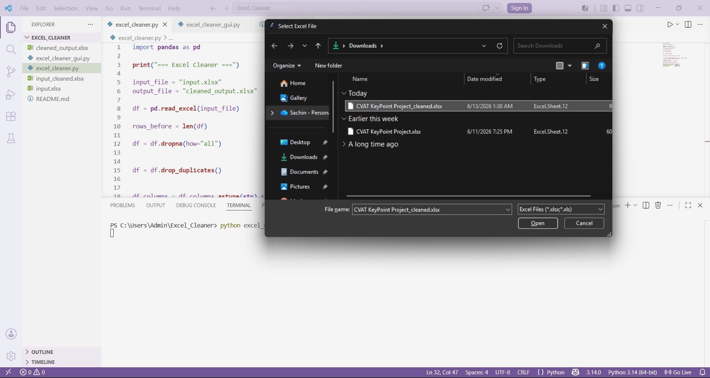

# Excel Cleaner Automation

A simple Python automation tool that cleans Excel files.

## Features
- Removes duplicate rows
- Removes completely empty rows
- Cleans extra spaces from column names
- Cleans extra spaces from text data
- Saves a cleaned Excel file automatically
## Screenshot

## Tech Used
- Python
- Pandas
- OpenPyXL
- Tkinter

## How to Run

Install required libraries:

pip install pandas openpyxl

Run the GUI version:

python excel_cleaner_gui.py

Select an Excel file and the tool will create a cleaned version automatically.
